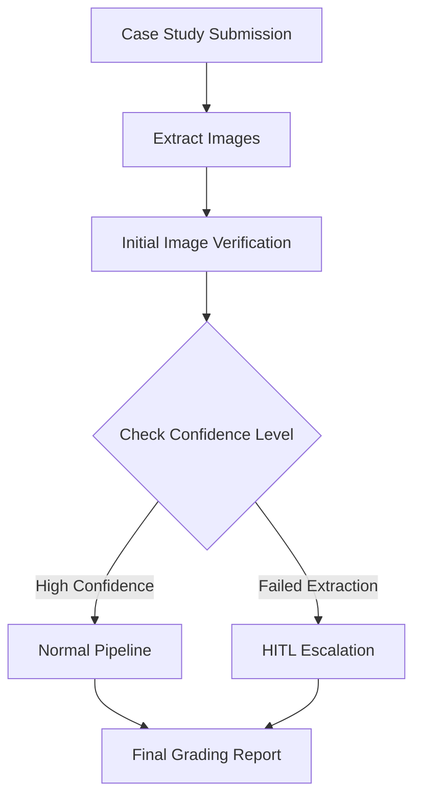

Here is the **revised Case Study Grading System – Technical Architecture document**, updated to align with the **ADR decision** of using **GPT-4V for multimodal grading** and adding the **image verification loop** to ensure all diagrams are processed correctly.

---

# **Case Study Grading System – Technical Architecture**

## **1. Introduction**

### **1.1 Purpose**
This document outlines the **technical architecture** for the Case Study Grading System. It details:
- **System components and interactions**
- **Data flows and sequence processing**
- **High availability and fault tolerance mechanisms**
- **Interfaces and integration points**
- **Technology stack and frameworks**
- **Fallback strategies for robustness**

This architecture follows the **same multi-agent framework as the short-answer grading system** (see ADR for **short-answer grading**) but **introduces an additional image verification step** to ensure that all architecture diagrams are processed correctly.

Unlike the short-answer grading system, which relies only on text-based GPT-4 models, this system uses **GPT-4V**, a **multimodal model capable of processing both text and images**.

---

## **2. System Overview**

### **2.1 Business Context**
The system automates the grading of architecture case studies by evaluating:
1. **Textual Content** – Checking structure, coherence, and adherence to grading rubrics.
2. **Reference Validation** – Ensuring citation accuracy and relevance.
3. **Diagram Evaluation** – Assessing architectural correctness using **GPT-4V**.
4. **Automated Feedback** – Generating structured scores and detailed feedback reports.

### **2.2 High-Level Components**
- **Grading Pipeline** – A multi-agent system responsible for evaluating different case study components.
- **Text Processing Engine** – Evaluates textual content using **GPT-4V**.
- **Reference Checker** – Validates citations using a retrieval-based approach.
- **Diagram Evaluator** – Ensures that architecture diagrams are properly analyzed by:
  - **Processing images within GPT-4V during the full-document evaluation**.
  - **Extracting and reprocessing images separately** in GPT-4V for verification.
  - **Escalating to human review (HITL) if any image fails to be processed**.
- **Final Aggregator** – Merges evaluation scores and applies weighting.

---

## **3. System Architecture**

### **3.1 Logical Architecture**
The system is modular, with dedicated agents for different grading aspects. The primary data flow is illustrated below:

### **3.2 Pipeline Interactions**
- **Input Partitioning:** The system parses each submission into text, references, and diagrams.
- **Parallel Processing:** Text, reference, and diagram evaluation occur concurrently.
- **Image Verification Loop:** After the **full-document grading step**, images are extracted and **reprocessed individually** through **GPT-4V** to verify their evaluation.
- **HITL Escalation:** If any diagram **fails to be processed**, the case is escalated to a **human reviewer**.
- **Synchronized Aggregation:** The Final Aggregator collects scores asynchronously, applies normalization, and generates the final report.

---

## **4. Data Flow & Processing**

### **4.1 Grading Workflow**
1. **Submission:** A user submits a case study document.
2. **Text Processing:** 
   - Document is chunked using hierarchical summarization
   - Each section is analyzed using GPT-4V with CoT + Refine
3. **Reference Validation:** The Reference Checker verifies citation accuracy using retrieval-based methods.
4. **Diagram Analysis:**  
   - **Initial Image Verification:**
     - Extract all images from document
     - Process each image through GPT-4V
     - Generate confidence score for each image
   - **Confidence-Based Processing Path:**
     - High confidence → Continue with normal pipeline
     - Low confidence → OCR + Rule-Based Parsing
     - Very low confidence → LLaVA-generated description
     - Failed extraction → HITL escalation
   - **Full Document Evaluation:** Process complete case study with verified images
5. **Score Aggregation:** Final Aggregator integrates scores with confidence weighting
6. **Feedback Generation:** Detailed grading report compiled

---

## **5. Technology Stack**

| **Component**            | **Technology**                |
|--------------------------|-------------------------------|
| **Text Grading Engine**  | GPT-4V                         |
| **Reference Checker**    | Retrieval-Based Approach      |
| **Diagram Evaluator**    | GPT-4V (with Image Verification Loop) |
| **Final Aggregator**     | Weighted Scoring Model        |

---

---

## **6. Conclusion**
This architecture provides a **robust, scalable, and secure grading system** for architecture case studies. By **leveraging the multi-agent approach from short-answer grading** and **adding an image verification step**, we ensure that **all case study components—including diagrams—are accurately processed**.

**Key Enhancements in This Design:**
  * **GPT-4V for unified text + image grading**  
  * **Image verification step to prevent skipped diagrams**  
  * **HITL escalation only when necessary**  
  * **Scalability through parallel batch processing**

### **Future Enhancements**
- **Adaptive grading models** – Adjust scoring logic based on prior case study data.
- **Optimized multimodal calls** – Reduce unnecessary processing where confidence is high.
- **Dynamic rubric adjustments** – Improve grading accuracy through self-refining models.

This design ensures **scalability, accuracy, and fairness**, making it well-suited for **automated case study grading**.

---
