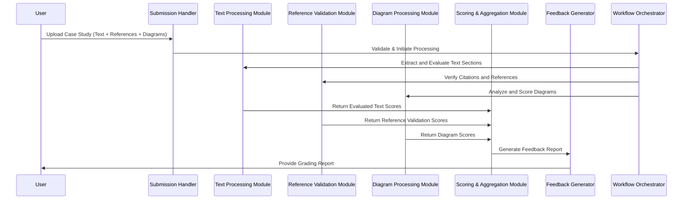
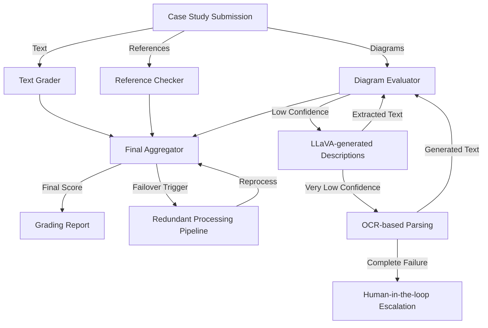
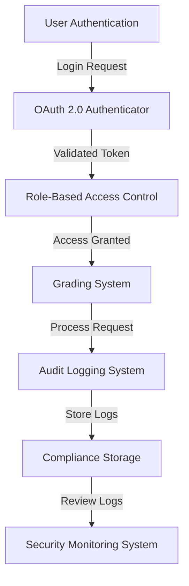

# Case Study Grading System - Level 2 Technical Architecture

## **1. Introduction**
### **1.1 Purpose**
This document provides a **detailed Level 2 architecture** for the Case Study Grading System, focusing on:
- **Detailed component interactions and API-level design**
- **Orchestration of grading processes and workflows**
- **Implementation details for developers**
- **Processing pipelines and execution logic**

This architecture assumes a **single model approach using GPT-4** for all grading components.

---

## **2. System Components and Orchestration**
### **2.1 Core Components**
1. **Submission Handler** – Receives case study documents (text, references, diagrams).
2. **Text Processing Module** – Splits long-form text into structured sections for evaluation.
3. **Reference Validation Module** – Extracts and validates citations using RAG.
4. **Diagram Processing Module** – Uses multimodal processing to evaluate architecture diagrams.
5. **Scoring and Aggregation Module** – Applies weights and normalizes scores.
6. **Feedback Generator** – Constructs a structured feedback report for users.
7. **Workflow Orchestrator** – Manages the end-to-end process execution.

---

## **3. Detailed Logical Architecture**

---

## **4. Execution Flow & Processing Pipelines**

### **4.1 Grading Pipeline**
1. **Document Submission & Preprocessing**
   - Extract text, references, and diagrams.
   - Validate submission format and structure.
2. **Text Processing & Evaluation**
   - Use **GPT-4** to analyze sections based on rubrics.
   - Apply **CoT + Refine** to improve accuracy.
3. **Reference Checking**
   - Retrieve cited references and compare them to case study content.
4. **Diagram Evaluation**
   - Process images using **GPT-4V** for multimodal assessment.
5. **Score Aggregation**
   - Normalize and combine scores from different modules.
6. **Feedback Generation**
   - Structure justifications and provide actionable feedback.

---

## **5. API & Interface Design**
| **Component** | **API Endpoint** | **Method** | **Description** |
|--------------|----------------|------------|----------------|
| **Submission Handler** | `/submit` | `POST` | Upload case study for grading |
| **Text Processor** | `/process-text` | `POST` | Process and analyze text sections |
| **Reference Validator** | `/validate-references` | `POST` | Verify accuracy of citations |
| **Diagram Processor** | `/process-diagram` | `POST` | Analyze architecture diagrams |
| **Scoring Aggregator** | `/aggregate-scores` | `POST` | Normalize and compute final score |
| **Feedback Generator** | `/generate-feedback` | `POST` | Generate structured feedback report |

---

## **6. High Availability & Fault Tolerance**

### **6.1 Resilience Mechanisms**
- **Failover Strategies:** Redundant processing pipelines ensure grading continuity.
- **Fallbacks for Diagram Processing:**
  - **High confidence** → Normal multimodal processing.
  - **Low confidence** → LLaVA-generated textual descriptions.
  - **Very low confidence** → OCR-based parsing.
  - **Complete failure** → Human-in-the-loop escalation.

## **7. Security & Compliance**

### **7.1 Authentication & Authorization**
- **OAuth 2.0 for API authentication**
- **Role-based access control (RBAC) for data security**

### **7.2 Compliance Considerations**
- **Data privacy standards** (GDPR, CCPA) enforced via access policies.
- **Audit logs** maintained for grading transparency.
### **6.1 Error Handling & Fallbacks**
- **Text Processing Failures:** Retry mechanism with fallback to simplified parsing.
- **Diagram Recognition Failures:**
  - **Low confidence → OCR-based extraction**
  - **Very low confidence → Human escalation**
- **Reference Checking Failures:** Use alternative search mechanisms.

### **6.2 Scalability Considerations**
- **Batch Processing:** Parallel grading pipelines for large-scale submissions.
- **Dynamic Scaling:** Auto-scaling based on submission volume.

---

## **7. Security & Compliance**
| **Security Measure** | **Implementation** |
|---------------------|------------------|
| **Authentication** | OAuth 2.0 for secure API calls |
| **Access Control** | RBAC to restrict grading data access |
| **Data Privacy** | Compliance with GDPR & CCPA |

---

## **8. Conclusion**
This Level 2 architecture defines the **developer-focused orchestration** of the grading system, ensuring **scalability, fault tolerance, and explainability** while leveraging **GPT-4** for all processing tasks.

