# Case Study Grading System - Level 3 Technical Design

## **1. API Documentation**
Complete API specifications are maintained in OpenAPI format under `/design/api/`:
- Main specification: `openapi.yaml`
- Path definitions: `paths/*.yaml`
- Data schemas: `schemas/*.yaml`

### **1.2 Authentication & Authorization**
- JWT-based authentication
- Token format and validation rules
- Role-based access control implementation

### **1.3 Error Handling**
- Standardized error responses
- Error logging and monitoring
- Retry mechanisms for transient failures

### **1.4 Rate Limiting**
- Per-endpoint limits
- Burst allowances
- Client identification strategy

## **2. Image Processing Implementation**

### **2.1 Image Verification Pipeline**
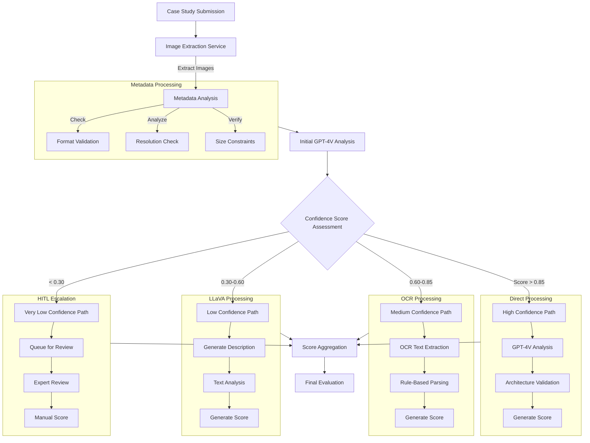

### **2.2 Processing Thresholds**
```yaml
Confidence:
  HighConfidence: 0.85
  MediumConfidence: 0.60
  LowConfidence: 0.30

ImageConstraints:
  MaxSize: 10MB
  SupportedFormats: [PNG, JPG, SVG]
  Resolution:
    Min: 300x300
    Max: 4096x4096

ProcessingPaths:
  High:
    Service: GPT-4V
    Timeout: 30s
  Medium:
    Service: OCR
    Engine: Tesseract
  Low:
    Service: LLaVA
    Model: v1.5
  VeryLow:
    Service: HITL
    MaxWaitTime: 24h
```

## **3. Core System Implementation**

### **3.1 Document Processing Service Architecture**

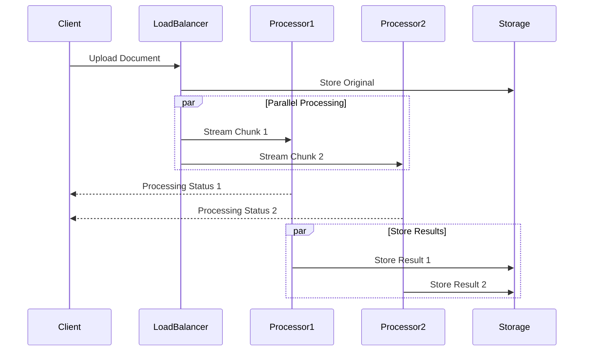

#### Technical Architecture
- **Protocol**: gRPC
- **Load Balancing**: Round-robin with health checks
- **Streaming**: Bi-directional for real-time updates
- **Chunking**: 1MB optimal chunks

#### Processing Flow
1. Document received via gRPC stream
2. Split into optimal chunks
3. Parallel processing across nodes
4. Results aggregation
5. Status updates to client

### **3.2 Grading Pipeline Architecture**

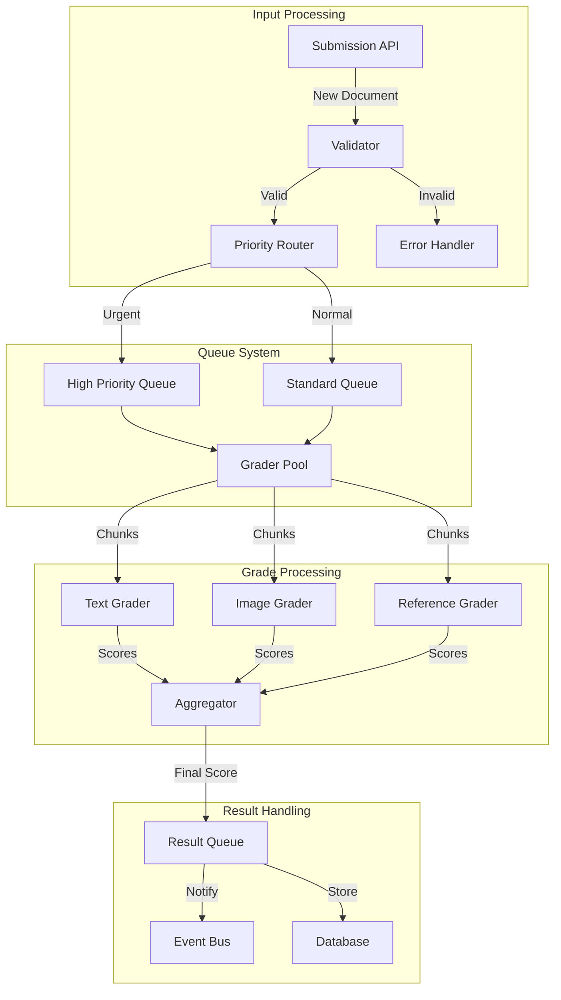

#### RabbitMQ Implementation
```yaml
Exchanges:
  grading:
    type: "topic"
    queues:
      high_priority:
        binding: "grade.urgent.*"
        arguments:
          x-max-priority: 10
          x-message-ttl: 3600000  # 1 hour
      standard:
        binding: "grade.normal.*"
        arguments:
          x-max-priority: 5
          x-message-ttl: 86400000  # 24 hours

  results:
    type: "direct"
    queues:
      aggregation:
        durable: true
        arguments:
          x-message-ttl: 86400000
      failed:
        durable: true
        arguments:
          x-dead-letter-exchange: "grading"
```

### **3.3 AI Service Integration**
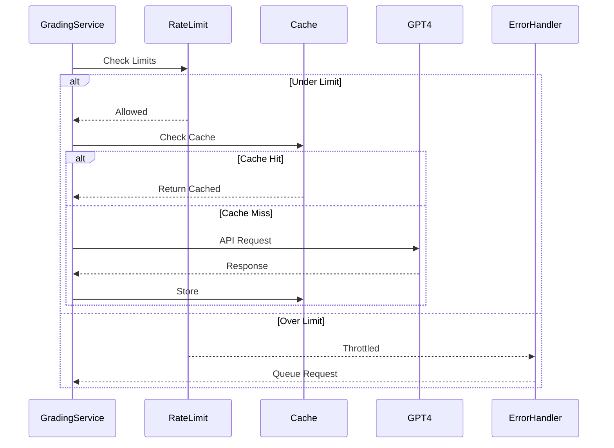

#### GPT-4 Integration Configuration
```yaml
APIConfig:
  endpoints:
    text_analysis: "/v1/completions"
    image_analysis: "/v1/images/analysis"
  
  rateLimit:
    requests_per_minute: 200
    burst: 250
    
  retry:
    max_attempts: 3
    backoff:
      initial: 1000  # ms
      multiplier: 2
      max: 8000  # ms

  cache:
    implementation: "Redis"
    ttl: 86400  # 24 hours
    maxSize: "10GB"
```

### **3.4 Event Notification System**
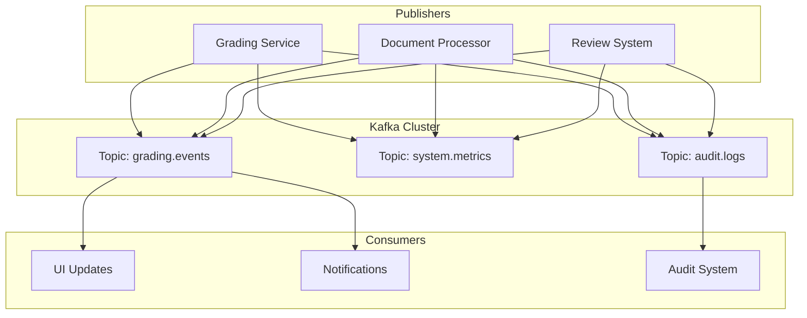

#### Kafka Configuration
```yaml
Topics:
  grading.events:
    partitions: 10
    replication_factor: 3
    retention:
      time: 604800000  # 7 days
      size: "10GB"
    
  system.metrics:
    partitions: 5
    replication_factor: 3
    retention:
      time: 172800000  # 2 days

ConsumerGroups:
  ui_updates:
    instances: 3
    config:
      auto.offset.reset: "latest"
      
  notifications:
    instances: 2
    config:
      auto.offset.reset: "earliest"
```

## **4. External Integration Architecture**

### **4.1 Storage Service**
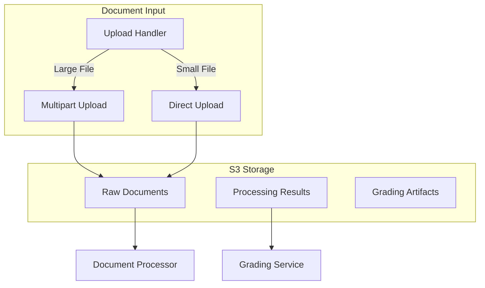

#### S3 Configuration
```yaml
Buckets:
  raw_documents:
    versioning: enabled
    lifecycle:
      transition_to_ia: 30  # days
      transition_to_glacier: 90  # days
    encryption: AES256
    
  processed_results:
    versioning: enabled
    lifecycle:
      expiration: 365  # days
    encryption: AES256

Upload:
  multipart_threshold: 10485760  # 10MB
  part_size: 5242880  # 5MB
  max_concurrency: 10
```

### **4.2 Human Review Interface**
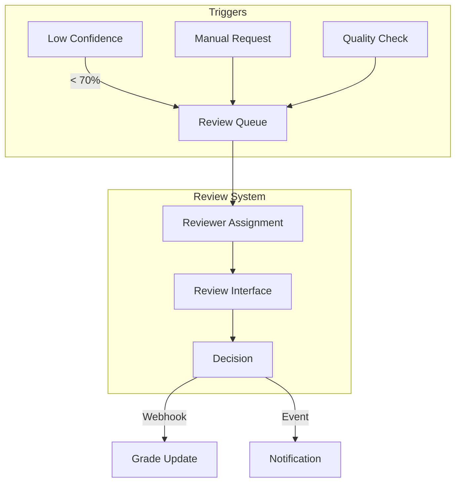

#### Webhook Configuration
```yaml
Endpoints:
  grade_review:
    url: "/api/v1/review"
    method: "POST"
    retry:
      max_attempts: 3
      backoff: exponential
    
  quality_check:
    url: "/api/v1/quality"
    method: "POST"
    timeout: 30000  # 30 seconds

Triggers:
  confidence_threshold: 0.70
  time_threshold: 300  # 5 minutes
  deviation_threshold: 0.20  # 20% from mean
```

### **4.3 External UI**
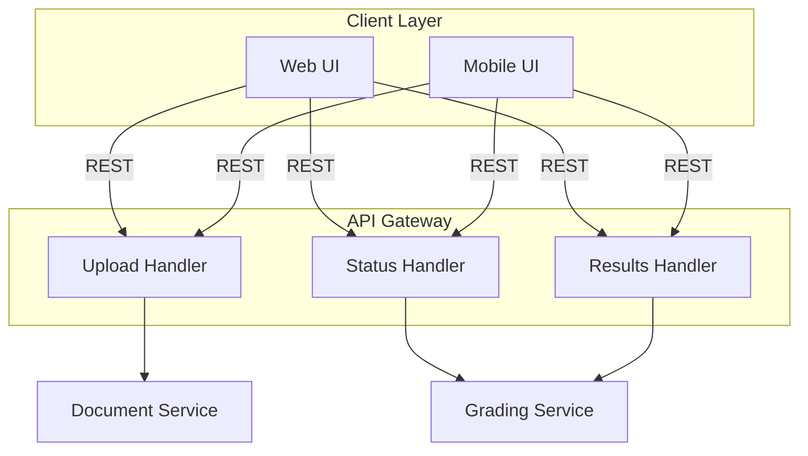

## **5. System Characteristics**

### **5.1 Performance Specifications**

#### Processing Capacity
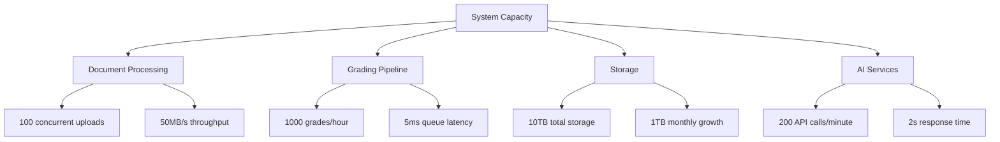

#### Peak Load Handling
- Normal Load: 100 submissions/hour
- Peak Load: 500 submissions/hour (exam periods)
- Burst Capacity: 1000 submissions/hour (5 minutes max)
- Auto-scaling trigger: 70% resource utilization

### **5.2 Failure Recovery**

#### Component Failure Scenarios
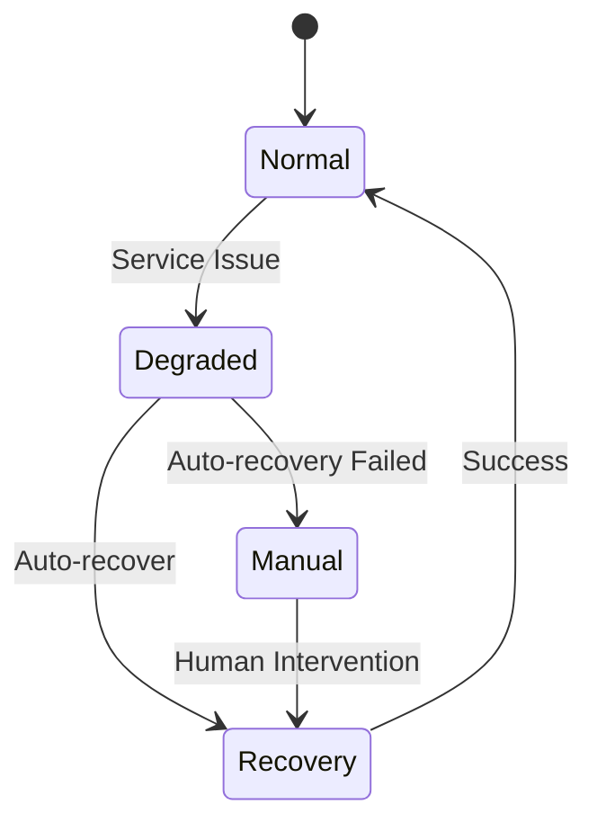

#### Recovery Strategies
1. **AI Service Unavailable**
   - Fallback to cached responses (24h validity)
   - Queue new requests for retry
   - Alert if queue depth > 1000

2. **Queue System Overload**
   - Trigger consumer auto-scaling
   - Apply back pressure to submissions
   - Buffer in local storage

3. **Storage System Issues**
   - Use local caching (5GB buffer)
   - Async replication catch-up
   - Redirect to backup region

### **5.3 Monitoring Thresholds**

#### Key Metrics
```yaml
Processing:
  upload_latency_p95: 2s
  processing_time_p95: 30s
  error_rate_threshold: 1%

Grading:
  completion_time_p95: 5min
  accuracy_threshold: 95%
  confidence_score_min: 0.7

Storage:
  read_latency_p95: 100ms
  write_latency_p95: 200ms
  availability_target: 99.99%

AI Service:
  response_time_p95: 2s
  cache_hit_ratio_min: 40%
  error_rate_max: 0.5%
```

### **5.4 System Resilience**

#### Failure Recovery Strategies


#### Recovery Procedures
1. **AI Service Disruption**
   - Fallback to cached responses (24h validity)
   - Queue new requests for retry
   - Alert if queue depth > 1000

2. **Queue System Overload**
   - Trigger consumer auto-scaling
   - Apply back pressure to submissions
   - Buffer in local storage

3. **Storage System Issues**
   - Use local caching (5GB buffer)
   - Async replication catch-up
   - Redirect to backup region

### **5.5 Scaling Parameters**

#### Auto-scaling Rules
```yaml
DocumentProcessor:
  min_instances: 3
  max_instances: 10
  scale_up:
    cpu_threshold: 70%
    queue_depth: 100
  scale_down:
    cpu_threshold: 30%
    queue_depth: 10

GradingService:
  min_instances: 5
  max_instances: 15
  scale_up:
    grading_latency: 1min
    queue_depth: 500
  scale_down:
    idle_time: 10min
    queue_depth: 50
```

### Message Broker Performance Metrics

#### RabbitMQ Performance
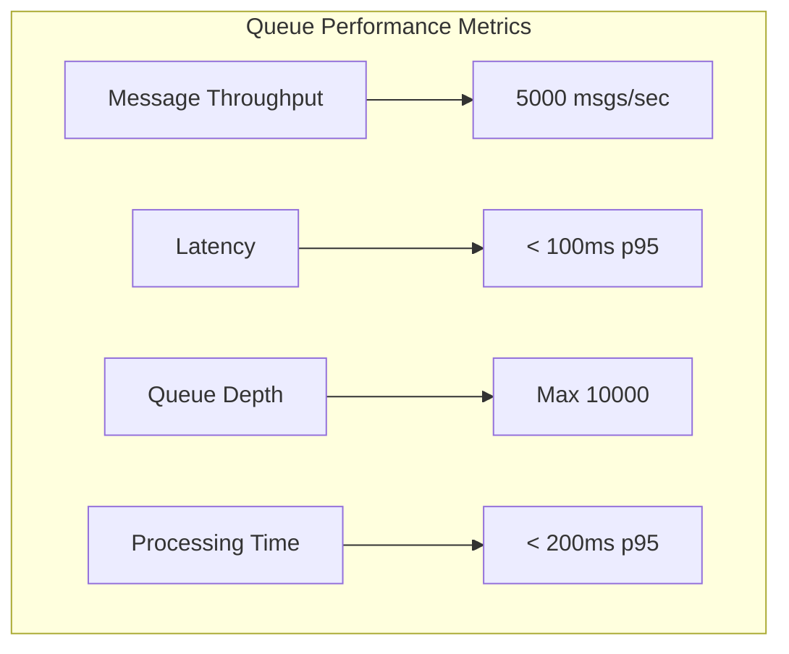

| Metric | Target | Alert Threshold | Critical Threshold |
|--------|--------|----------------|-------------------|
| Queue Latency | < 100ms | > 200ms | > 500ms |
| Message Rate | 5000/sec | < 3000/sec | < 1000/sec |
| Dead Letter Rate | < 0.1% | > 0.5% | > 1% |
| Consumer Lag | < 100 | > 500 | > 1000 |

#### Kafka Performance
| Metric | Target | Alert Threshold | Critical Threshold |
|--------|--------|----------------|-------------------|
| Producer Latency | < 10ms | > 50ms | > 100ms |
| Consumer Lag | < 1000 msgs | > 5000 msgs | > 10000 msgs |
| Topic Throughput | 10000/sec | < 7000/sec | < 3000/sec |
| Replication Lag | < 100ms | > 500ms | > 1000ms |

#### Redis Cache Performance
| Metric | Target | Alert Threshold | Critical Threshold |
|--------|--------|----------------|-------------------|
| Response Time | < 10ms | > 50ms | > 100ms |
| Hit Rate | > 80% | < 60% | < 40% |
| Memory Usage | < 70% | > 80% | > 90% |
| Eviction Rate | < 100/sec | > 500/sec | > 1000/sec |

#### System-wide Message Processing
```yaml
Processing:
  grading_queue:
    peak_throughput: "5000/second"
    average_latency: "< 100ms"
    error_rate: "< 0.1%"
    recovery_time: "< 30s"

  event_streaming:
    throughput: "10000/second"
    end_to_end_latency: "< 500ms"
    data_loss: "zero"
    partition_count: 10

  caching:
    hit_ratio: "> 80%"
    eviction_rate: "< 100/second"
    replication_lag: "< 50ms"
```