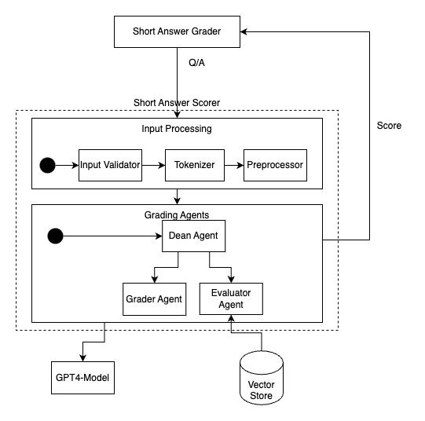

# **Level 1 Architecture Document: Short-Answer Grading System for Architecture Certification Exam**

## **1. Overview**
The **Short-Answer Grading System** is designed to **automate the evaluation of candidate responses** for an architecture certification exam. The system leverages **multi-agent orchestration** to ensure fairness, explainability, and accuracy while keeping human intervention minimal.

## **2. Core System Components**
1. **Input Processing Layer**
   - Handles candidate responses.
   - Prepares data for grading (tokenization, length validation).

2. **Multi-Agent Grading Layer**
   - **Grader Agent**: Evaluates correctness, coherence, and depth using **CoT + Refine**.
   - **Evaluator Agent**: Verifies answers against **retrieved reference material**.
   - **Dean Agent**: Normalizes scores for consistency and fairness.

3. **Scoring & Feedback Engine**
   - Generates **final scores**.
   - Provides **detailed feedback** on performance.

4. **Storage & Reporting Module**
   - Stores graded responses for auditing.
   - Generates performance reports for candidates.

## **3. Data Flow Overview**
1. **Candidate submits a response.**
2. **Input processing prepares the answer.**
3. **Multi-Agent Grading Layer evaluates and scores the response.**
4. **Final scores and feedback are generated and stored.**
5. **Candidate receives graded results.**

## **4. Level 1 Design**
The **Technical Architecture Diagram** highlights **technical platforms, frameworks, and services**.

### **Guidelines:**
- Define **specific platforms and frameworks**
- Highlight **service interactions**
- Keep it **high-level** while ensuring clarity

## **5. Scalability & Performance Considerations**
- **Batch Processing** for concurrent grading.
- **Parallel Execution** of multiple agents.
- **Adaptive Model Invocation** to optimize costs based on complexity.

## **6. Component Breakdown**
A structured view of the **logical components and their descriptions**.
Here is the requested table without the **Technology** column:

| Component            | Description                               |
|---------------------|-------------------------------------------|
| **Grader Agent**    | Assigns scores using CoT+Refine          |
| **Evaluator Agent** | Verifies accuracy using RAG              |
| **Dean Agent**      | Normalizes and finalizes scores          |
| **Feedback Generator** | Generates structured responses        |
| **Storage & Reporting** | Stores responses, scores, and trends |

Let me know if you need any further modifications! 🚀

## **7. Conclusion**
This document provides a structured view of the **Technical Architecture (Level 1)** for **Short-Answer Grading**, aligning **business needs** with **technical solutions**.

