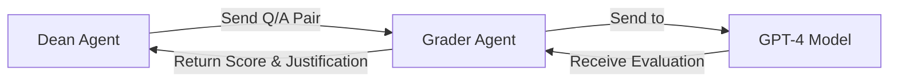
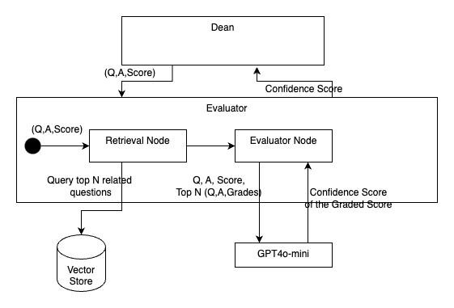
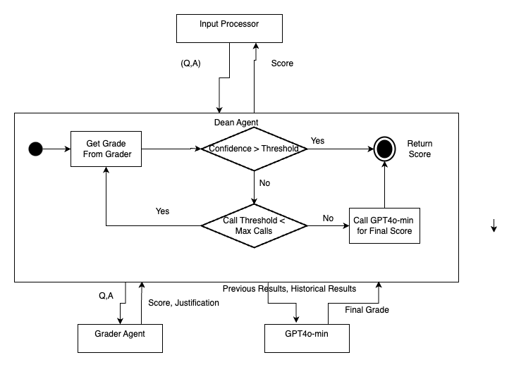
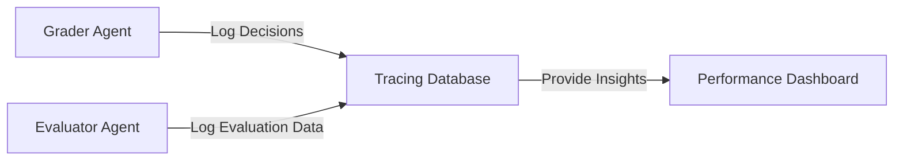
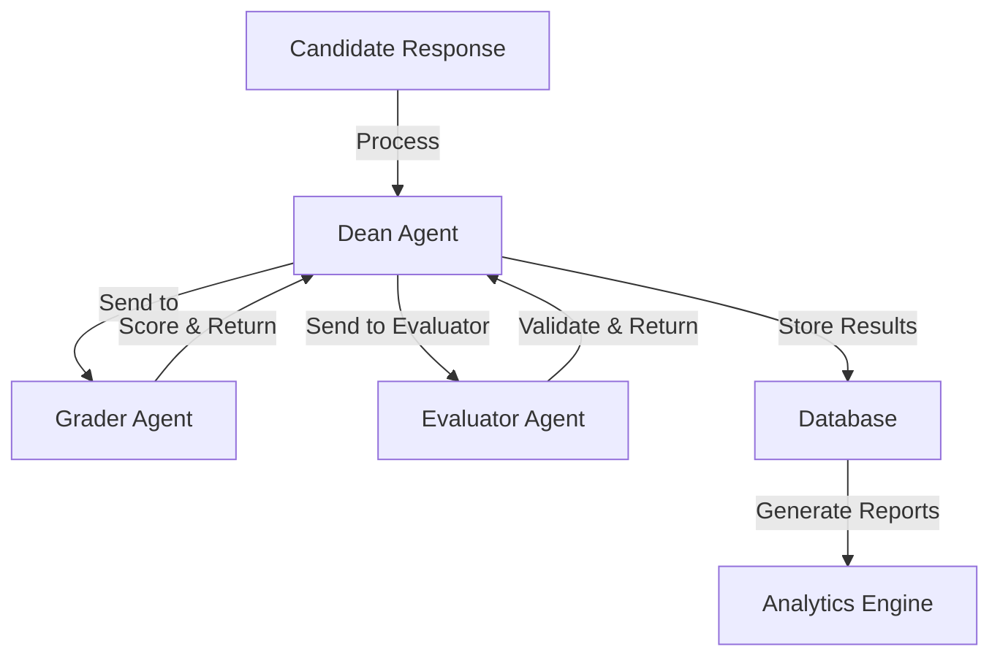

# **Level 2 Detailed Architecture Document: Short-Answer Grading System for Architecture Certification Exam**

## **1. Overview**
The **Short-Answer Grading System** automates the evaluation of candidate responses in an architecture certification exam. The system leverages **multi-agent orchestration** for fairness, explainability, and accuracy while minimizing human intervention.

## **2. Core System Components**
### **2.1 Input Processing Layer**
- **Candidate Response Handling:** Captures short-answer responses from candidates via the exam interface.
- **Preprocessing Engine:** 
  - Tokenizes responses.
  - Cleans and standardizes input for analysis.
  - Performs length validation and anomaly detection.

### **2.2 Grader Agent**
- **Primary Function:** Assigns scores based on a rubric using **CoT (Chain-of-Thought) + Refine**.
- **Processing Steps:**
  1. Receives **question-answer pair** from the Dean Agent.
  2. Sends the response to **GPT-4** for evaluation.
  3. Applies **CoT-based reasoning** to ensure a step-by-step explanation.
  4. Returns a **graded response** back to the Dean Agent.



### **2.3 Evaluator Agent**
- **Primary Function:** Uses **Retrieval-Augmented Grading (RAG)** to verify accuracy.
- **Processing Steps:**
  1. Receives **graded response** from the Dean Agent.
  2. Compares the response against a **reference knowledge base**.
  3. Runs **retrieval and semantic similarity matching** inside a **RAG Pipeline**.
  4. Returns **feedback and confidence level** back to the Dean Agent.



 [//]: # (```mermaid)
[//]: # (graph LR;)
[//]: # (    A[Dean Agent] -->|Send Q/A Score| B[Evaluator Agent])
[//]: # (    subgraph RAG Pipeline)
[//]: # (        C[Vector Store] -->|Retrieve Relevant Context| D[Retrieval Node])
[//]: # (        D -->|Semantic Similarity Matching| E[Scoring Node])
[//]: # (    end)
[//]: # (    B -->|Evaluate with RAG| E)
[//]: # (    B -->|Return Feedback & Confidence| A)
```

### **2.4 Dean Agent**
- **Primary Function:** **Orchestrates the grading pipeline**, ensuring iterative feedback loops for accuracy.
- **Processing Steps:**
  1. Sends **question-answer pairs** to the **Grader Agent**.
  2. Receives **initial grading** from the Grader Agent.
  3. Sends **graded response** to the Evaluator Agent for validation.
  4. If **confidence level is low**, re-routes response back to the Grader Agent for refinement.
  5. If **confidence is sufficient**, finalizes the score and feedback.



[//]: # (```mermaid)

[//]: # (graph TD;)
[//]: # (    A[Dean Agent] -->|Send Q/A to Grader| B[Grader Agent])
[//]: # (    B -->|Return Score| A)
[//]: # (    A -->|Send to Evaluator| C[Evaluator Agent])
[//]: # (    C -->|Return Feedback & Confidence| A)
[//]: # (    A -->|Check Confidence| D{Confidence > Threshold?})
[//]: # (    D --Yes--> E[Finalize Score & Feedback])
[//]: # (    D --No--> F[Send Back for Regrading])
[//]: # (    F -->|Pass Feedback to| B)
```

### **2.5 Storage & Reporting Module**
- **Database Management:**
  - Stores candidate responses and grading history.
  - Uses **PostgreSQL** for structured storage.
- **Performance Reporting:**
  - Generates analytics and grading trends.
  - Allows retrieval for auditing and compliance.
- **Tracing and Model Performance Storage:**
  - Logs **each agent's decisions and intermediate outputs** for explainability.
  - Stores **Grader Agent and Evaluator Agent performance metrics** to track grading quality.
  - Captures **model confidence scores, feedback iterations, and evaluation loop counts** to improve system accuracy.
  - Enables **real-time monitoring dashboards** for debugging and performance tracking.



### **2.6 System Overview Diagram**


## **3. Scalability & Performance Considerations**
- **Batch Processing** for high-throughput grading.
- **Parallel Execution** to handle multiple candidates concurrently.
- **Caching & Indexing** in the database for fast retrieval of reference materials.
- **Event-driven architecture** to support real-time grading enhancements.

## **4. Component Breakdown**
A detailed view of the **logical components and their descriptions**.

| Component | Description |
|-----------|------------|
| **Grader Agent** | Assigns scores using CoT+Refine, receives Q/A pairs from Dean |
| **Evaluator Agent** | Verifies accuracy using RAG, processes {Q/A, Score} sets |
| **Dean Agent** | Orchestrates grading, manages feedback loops, finalizes scores |
| **Storage & Reporting** | Stores responses, scores, trends, and model performance data |
| **Tracing Database** | Logs decisions, evaluations, and model performance data |
| **Performance Dashboard** | Provides real-time monitoring and analytics |

## **5. Conclusion**
This document provides a **detailed technical breakdown** of the **Short-Answer Grading System (Level 2 Design)**, ensuring clarity in component interactions and system scalability. The design aligns with efficiency, fairness, and explainability in automated grading.

