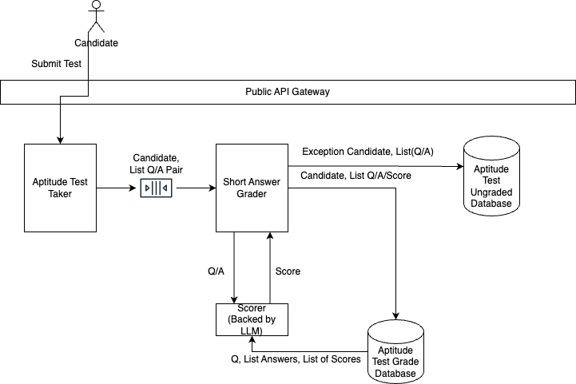
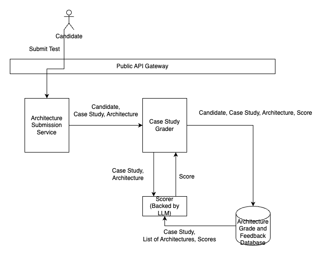

# Introduction

The goal of this architecture is to automate the manual grading of the tests as they come in. For the certification system, the parts of the system most prone to break at scale is at each part of the grading system.

# Certification Process 1 High Level Design

For this part of the architecture, the short answer grader system will replace the manual grading process. This grader system will be backed by a LLM. For a particular test submitted by a candidate, there will be a list of questions and answers. Each Q/A pair will be submitted to the scorer and a score will be returned in response. To help improve the accuracy of the grading, the historical repository of previously scored questions and answers can be leveraged by the LLM system. 

There may be cases where a question cannot be reliably scored by the automation system. In these cases, the questions will be inserted ungraded in the database for manual inspection. The goal for this automation system is that the exception cases will be nominal.

# Certification Process 2 High Level Design

The certification process architecture differs in that the entire test scoring needs to transition from a manual process to an automated one. In this case, it's a single case study with a single architecture answer, although both the question and the answer is considerably more complicated. There will be more opportunities for the automated system to be unable to provide a reliable grade and more likely a case study will need a human intervener. A similar safeguard is shown in this architecture.
