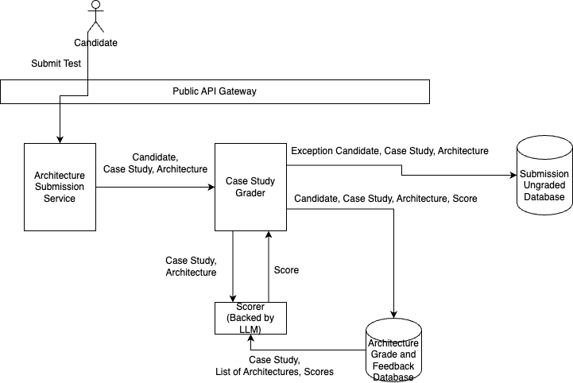

# Introduction

The goal of this architecture is to automate the manual grading of the tests as they come in. For the certification system, the parts of the system most prone to break at scale is at each part of the grading system.

# Certification Process 1 High Level Design

For this part of the architecture, the short answer grader system will replace the manual grading process. This grader system will be backed by a LLM. For a particular test submitted by a candidate, there will be a list of questions and answers. Each Q/A pair will be submitted to the scorer and a score will be returned in response. To help improve the accuracy of the grading, the historical repository of previously scored questions and answers can be leveraged by the LLM system. 

Since the questions can evolve over time, the set of similar questions can be supplied.

# Certification Process 2 High Level Design

Similarly, this part of the architecture, the case study and supplied architecture design must be scored by another automated grader. Similarly, the repository of scores can be made available to assist with the grading.
