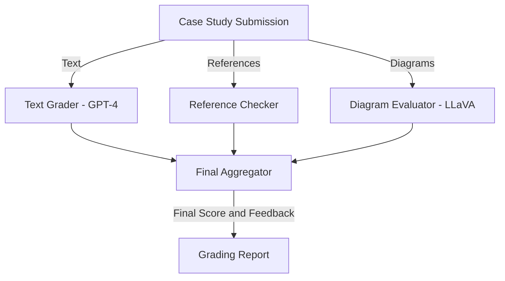
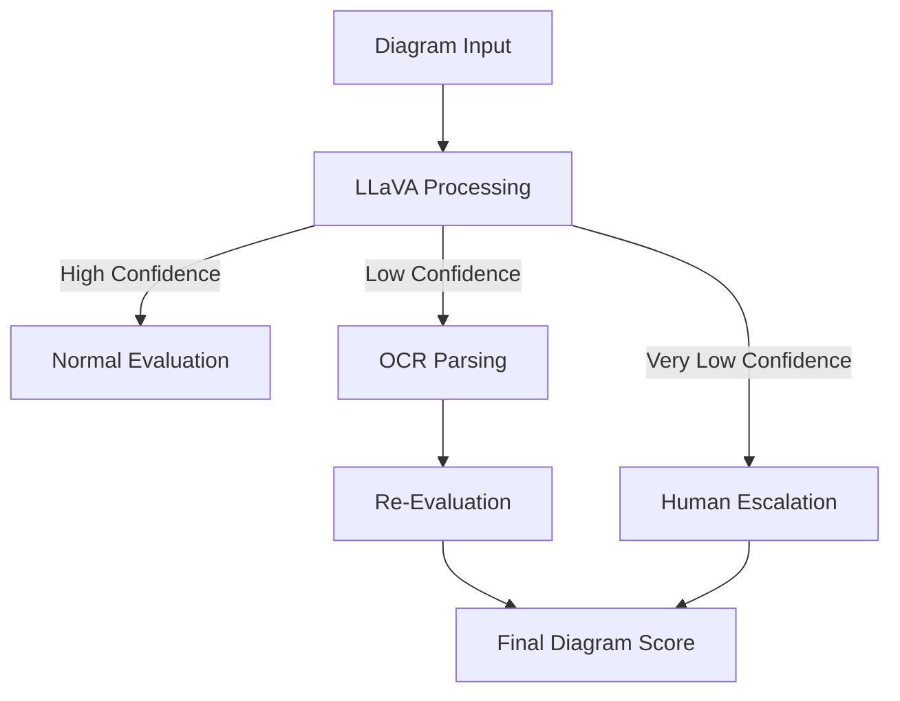
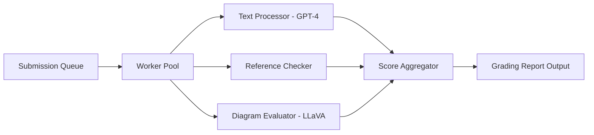
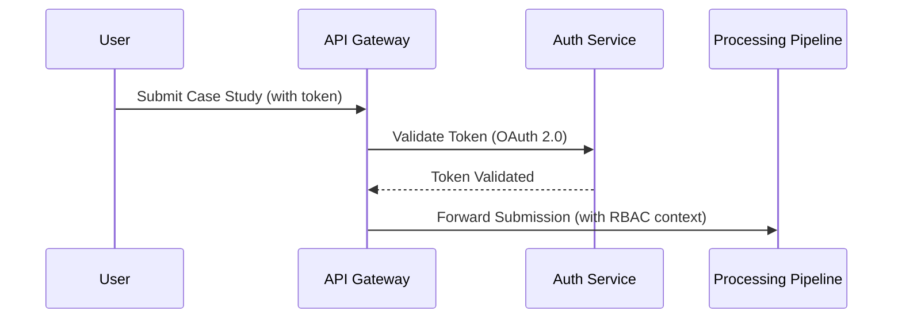

Below is the complete revised architecture document with corrected Mermaid diagrams and syntax.

---

# Case Study Grading System – Technical Architecture

## 1. Introduction

### 1.1 Purpose
This document outlines the **technical architecture** for the Case Study Grading System. It details:
- **System components and interactions**
- **Data flows and sequence processing**
- **High availability and fault tolerance mechanisms**
- **Interfaces and integration points**
- **Technology stack and frameworks**
- **Fallback strategies for robustness**

The architecture supports grading **long-form case studies** that include text, references, and architecture diagrams—ensuring structured, explainable, and scalable processing.

---

## 2. System Overview

### 2.1 Business Context
The system automates the grading of architecture case studies by evaluating:
1. **Textual Content:** Checks structure, coherence, and adherence to grading rubrics.
2. **Reference Validation:** Verifies citation accuracy and relevance.
3. **Diagram Evaluation:** Assesses architectural correctness using vision models.
4. **Automated Feedback:** Generates structured scores and detailed feedback reports.

### 2.2 High-Level Components
- **Grading Pipeline:** A modular system responsible for evaluating each case study component.
- **Text Processing Engine:** Assesses textual submissions using **GPT-4**.
- **Reference Checker:** Validates references using a retrieval-based approach.
- **Diagram Evaluator:** Processes diagrams using **LLaVA**, with an OCR-based fallback.
- **Final Aggregator:** Integrates scores from all subsystems and applies weighted computations.

---

## 3. System Architecture

### 3.1 Logical Architecture
The system is divided into modular components, each focusing on a specific grading aspect. The primary data flow is illustrated in the diagram below:

### 3.2 Pipeline Interactions
- **Input Partitioning:** The system parses each submission into text, references, and diagrams.
- **Parallel Processing:** Text, reference, and diagram evaluation occur concurrently.
- **Synchronized Aggregation:** The Final Aggregator collects scores asynchronously, applies normalization, and generates the final report.

---

## 4. Data Flow & Processing

### 4.1 Grading Workflow
1. **Submission:** A user submits a case study document.
2. **Text Processing:** The document’s text is segmented and analyzed for quality using **GPT-4**.
3. **Reference Validation:** The Reference Checker verifies citation accuracy using retrieval-based methods.
4. **Diagram Analysis:** The Diagram Evaluator processes images using **LLaVA**:
    - **High Confidence:** Normal processing using LLaVA.
    - **Low Confidence:** Falls back to OCR-based parsing.
    - **Very Low Confidence:** Escalates to human review.
5. **Score Aggregation:** The Final Aggregator integrates scores, applies weighting, and normalizes the results.
6. **Feedback Generation:** A detailed grading report is compiled and delivered to the user.

---

## 5. Technology Stack

| **Component**            | **Technology**                |
|--------------------------|-------------------------------|
| **Text Grading Engine**  | GPT-4                         |
| **Reference Checker**    | Retrieval-Based Approach      |
| **Diagram Evaluator**    | LLaVA (with OCR fallback)     |
| **Final Aggregator**     | Weighted Scoring Model        |

---

## 6. High Availability & Fault Tolerance

### 6.1 Resilience Mechanisms
- **Redundant Pipelines:** Each grading module runs in redundant clusters to prevent single points of failure.
- **Fallback Strategies for Diagram Processing:**
  - **High Confidence:** Processed normally using **LLaVA**.
  - **Low Confidence:** Falls back to OCR-based parsing.
  - **Very Low Confidence:** Escalates to human review.

The fallback process is illustrated in the following diagram:

### 6.2 Scalability
- **Parallel Batch Processing:** Multiple submissions are processed concurrently to handle high volumes.
- **Dynamic Resource Allocation:** Processing resources are dynamically allocated based on current workload.

The scalability setup is depicted in this diagram:

---

## 7. Security & Compliance

### 7.1 Authentication & Authorization
- **OAuth 2.0:** Secures API endpoints.
- **Role-Based Access Control (RBAC):** Ensures that only authorized users can access sensitive system functionalities and data.

The following sequence diagram outlines secure interactions:

### 7.2 Compliance Considerations
- **Data Privacy:** The system enforces GDPR, CCPA, and other data protection standards through stringent access policies.
- **Audit Logs:** Detailed logs are maintained for all grading activities to ensure transparency and compliance.

---

## 8. Conclusion

This architecture provides a robust, scalable, and secure platform for grading architecture case studies. With clear pipeline interactions and well-defined fallback mechanisms for diagram evaluation, the system is equipped to handle complex grading tasks while maintaining high availability and compliance.

Future enhancements may include adaptive grading models and dynamic rubric adjustments based on continuous feedback and learning.

---