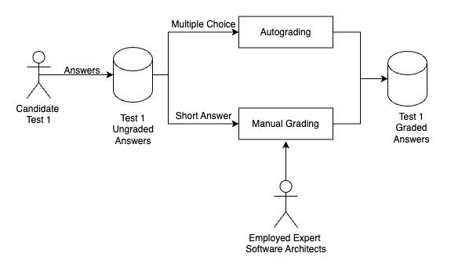
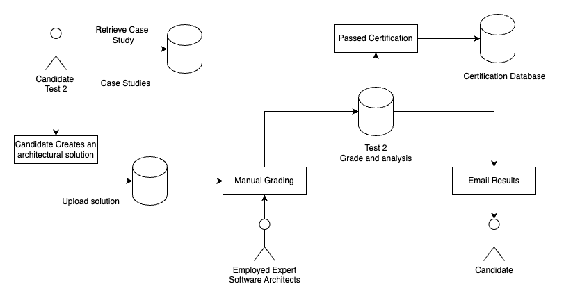
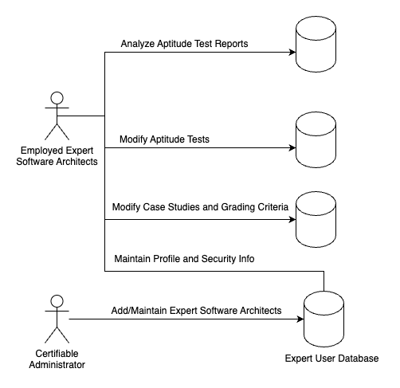
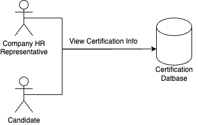

# Introduction 
Enhance an existing architecture that implements an Architecture Certification system. The enhancement should use artificial intelligence to provide enough automation to handle the expected scale that threatens to overwhelm the current manual processes.

# Certification Process Test 1: Aptitude Test

Certiable guarantees a 1-week turnaround for grading this test. It takes on average three hours to grade the short answer section of test 1. 

Currently, 300 expert software architects grade the tests and 5 deigned experts modify the tests as needed.

Currently, 200 candidates request certification a week across the US but that number is projected to grow 5-10X as well as the anticipated 21% growth over the next 4 years.

Properly grading the test is extremely important. Automating this stage of the test must match or exceed the quality of manual grading.

Current load: 200 requests requiring 600 hours/week or 2 hours per week for test 1 per architect.
Projected load worst case (10x): 2000 requests requiring 6000 hours or 20 hours per week for test 1 per architect for the first year, growing at 21% per year.

# Certification Process Test 2: Architecture Solution

To qualify to take the second round fo the test, the candidate must pass the first test with a minimum score of 80%.

The candidate has two weeks from the time they download the case study to upload the solution. The expert architect has 1 week to grade the submitted solution. 

Candidates who fail either test can reapply to take the certification - increasing the test load on the system.

It takes on average 8 hours to grade the architecture submission for test 2.

To automate the manual test certification process the quality of the score must match the quality of the manual grading process.

Current load: While the exact pass rate was not given, if 100% of all testers passed and immediately began test 2, the worst case load would be 1600 hours/week or 5 hours per week per architect. With the projected load, it grows to: 16,000 hours/week or 50 hours per week. The actual load woudld be lower than this.

# Administrative Process

On a regular basis, architects need to analyze questions and make updates to continuously improve the quality of the tests as well as modernizing the questions to keep up with the latest trends.

# Certification Results

Certification info should be provided in a database. This use case provides no load on the software architects who have to absorb the majority of the manual load at risk as the demand scales.
